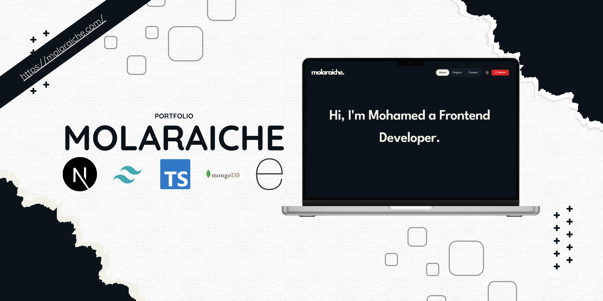

# molaraiche

molaraiche is my personal portfolio, i create it as a showcase for my skills, and my built projects, it's a fullstack web application

## Main Features

- Dashboard to manage projects
- Dark Mode
- Filter functioanlity
- Contact form
- Extremly SEO optimization (92)
- High performance optimization (100)

## Technologies Used

- [Next.js](https://nextjs.org/)
- [Tailwind CSS](https://tailwindcss.com/)
- [TypeScript](https://www.typescriptlang.org/)
- [JavaScript](https://developer.mozilla.org/en-US/docs/Web/JavaScript)
- [Node](https://nodejs.org/en)
- [Express](https://expressjs.com/)
- [MongoDB](https://www.mongodb.com/)
- [JWT](https://jwt.io/)

## 🚀 Running the Development Server

```bash

# clone the project
git clone https://github.com/molaraiche/mern-portfolio.git

# Go to the main folder
cd mern-portfolio
cd admin
npm install
npm run dev
cd ..
cd client
npm install
npm run dev
cd ..
cd server
npm install
npm run dev

```

## Developer Contact

[molaraiche](http://molaraiche.com/)
